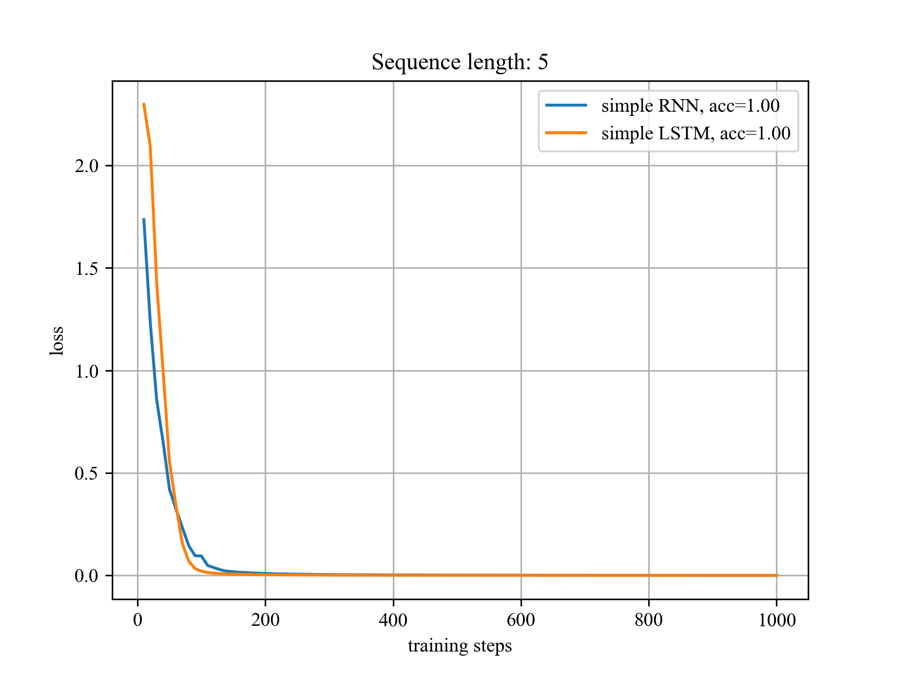

#### Task 1.1 Implement LSTM without `torch.nn.LSTM`

The forwarding function is shown here:

```python
    def forward(self, current_input, prev_hidden, prev_cell):
        
        concatenate = torch.cat((current_input, prev_hidden), 1)

        f = self.f_gate(concatenate)
        i = self.i_gate(concatenate)
        g = self.g_gate(concatenate)
        o = self.o_gate(concatenate)

        current_cell = g * i + prev_cell * f
        current_hidden = o * self.tanh(current_cell)
        current_output = self.hidden_to_out(current_hidden)

        return current_output, current_hidden, current_cell
```

`self.f_gate` is a linear layer. According to the LSTM formula, `g_gate` uses tanh activation while others uses sigmoid activation.

The figure below is the loss of LSTM and RNN network with default hyperparameters (x axis are cut to first 1000 records). 


#### Task 1.2 Comparison between LSTM and RNN in Longer Sequence

**1. Training Configurations**

In this experiment, `Adam` optimizer will be used instead of `RMSProp`. 

Hyperparameters such as learning rates are specified for different models to reach their best performances.

**Result**

 Here are simple comparisons between LSTM and RNN with different sequence length.




We can conclude that LSTM outperforms RNN in sequence prediction, but both RNN and LSTM failed to learn in length 20 sequence.

**2. Techniques (or Tricks)**

It's difficult to train the model on a long sequence with only one label and only one input that contains the information of label.

The trick is utilize the model trained on a short sequence as the pre-trained model, which can expand the ability of both RNN and LSTM to learn on a long sequence.

Psudocode:

```python
model = LSTM().init()
for length in [10, 20, 30, ...]:
    fit(model, data(length))
    eval(model, data(length))
```

**Result**

Both RNN and LSTM Performs perfectly (*Accuracy = 100%*) all the way to 150 length sequence before a memory shortage.


#### Task 2.1 GAN Model

To make the model training easier, the generator and discriminator are fully-connected.

```python
# G: latent -> 256 -> 512 -> 1024 -> 1 * 28 * 28
# D: 1 * 28 * 28 -> 1024 -> 512 -> 256 -> 1
```

Output of two models are processed by sigmoid and BCELoss.

RMSProp will be utilized instead of Adam.

Note that since the discriminator can always learn faster than the generator, in every step, the discriminator will be trained (perform back-propagation) according to the probability
$$
p_{\mathrm{trainD}}=\frac{e^{L(D)}}{e^{L(D)}+e^{L(G)}}
$$
and the generator will be trained in every step.

#### Task 2.2 GAN Model Results

How to see task 2.2 results:

1. run `my_gan.py` to train the model (the models are pre-trained before assignment submission)
2. run `Part2.ipynb` part 2.2

Here are the training result:

Start:


Middle:


Final:


#### Task 2.3 Latent space interpolation

The task 2.3 in `Part2.ipynb` has two pieces.

1. Run the first piece of code, check the result.
2. If two images generated by the first piece of code are of different categories, run the second piece of code.

You can see result like this:


The model learns directly from the Gaussian noise to images of written digits.

However, *simple* digits such as 0 and 1 are more likely to be generated while *complex* digits, like 4, are less likely to be generated. Which could be a sense of over-fitting.
